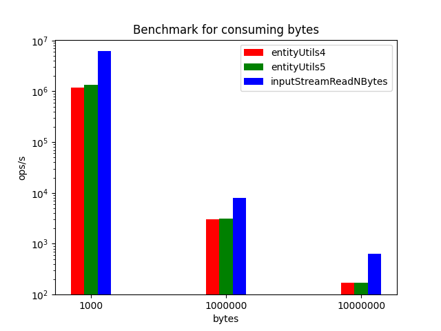

# httpcomponent-entitiyutils-benchmarks

Our team found EntityUtils.toByteArray is significantly slow in edge case.

If the HTTP server returns large response without content-length header(typically chunked response), EntityUtils.toByteArray is quite slower than InputStream.readAllBytes.

This repository contains the benchmark code of this.

# Benchmark result

The result on which my local computer (Mac, Memory 32GB, 2.6GHz 6core Intel Corei i7) is below.



```
Benchmark                        (respSize)   Mode  Cnt        Score        Error  Units
BenchMain.entityUtils4                 1000  thrpt    5  1195117.928 ± 705097.488  ops/s
BenchMain.entityUtils4              1000000  thrpt    5     3026.675 ±    478.353  ops/s
BenchMain.entityUtils4             10000000  thrpt    5      168.823 ±     19.538  ops/s
BenchMain.entityUtils5                 1000  thrpt    5  1344079.434 ± 200777.244  ops/s
BenchMain.entityUtils5              1000000  thrpt    5     3095.293 ±    205.984  ops/s
BenchMain.entityUtils5             10000000  thrpt    5      168.321 ±     26.166  ops/s
BenchMain.inputStreamReadNBytes        1000  thrpt    5  6140755.074 ± 928758.062  ops/s
BenchMain.inputStreamReadNBytes     1000000  thrpt    5     8072.631 ±   1158.289  ops/s
BenchMain.inputStreamReadNBytes    10000000  thrpt    5      640.349 ±    191.837  ops/s
```

The throughput of EntityUtils.toByteArray seems to drop dramatically as the size of the byte array to read increases.

# Why it's slow?

After investigating the cause of the difference in performance, the following reasons can be considered.

* When Content-Length is not known in advance, the initial size of ByteArrayBuffer used by EntityUtils.toByteArray seems to be 4096 bytes.
  * https://github.com/apache/httpcomponents-core/blob/45d8a4cb391f591bb8d380b820437b651435774f/httpcore/src/main/java/org/apache/http/util/EntityUtils.java#L122-L145
* In that case, since the initial buffer size is small, the condition for increasing the buffer size at buffer.append is hit every time, so it seems that the buffer size is expanded every time after reading from the InputStream.
  * https://github.com/apache/httpcomponents-core/blob/45d8a4cb391f591bb8d380b820437b651435774f/httpcore/src/main/java/org/apache/http/util/ByteArrayBuffer.java#L74-L91
* Looking at the implementation of ByteArrayBuffer.expand, you can see that each time it is called, it allocates a new size byte array and copies from the old byte array to the new one.
  * https://github.com/apache/httpcomponents-core/blob/45d8a4cb391f591bb8d380b820437b651435774f/httpcore/src/main/java/org/apache/http/util/ByteArrayBuffer.java#L56-L60

It can be inferred that excessive byte array allocation and array copy processing performed by this ByteArrayBuffer.expand processing is the cause of the extremely low throughput.

At this time, the flow of processing of EntityUtils.toByteArray is, first, assuming DEFAULT_BUFFER_SIZE to $N$,

* The first time, allocation of byte[ $N$ ] and copying of elements occur $N$ times.
* Next, a byte[ $2N$ ] allocation and $2N$ element copies occur.
* Next, a byte[ $3N$ ] allocation and $3N$ element copies occur.
* And for the Mth time, an allocation of byte[ $MN$ ] and an element copy $MN$ times occur.

And so on, the total number of element copies is the sum of all of these.

Therefore, the number of element copies increases quadratically as follows.

$$ N + 2N + 3N + ... + MN = N(1 + 2 + 3 + ... + M) = \frac{1}{2}NM(M + 1) $$

On the other hand, readNBytes performs $2MN$ element copies. It does not grow quadratically.

# How do I run benchmark suite?

`./gradlew run`
